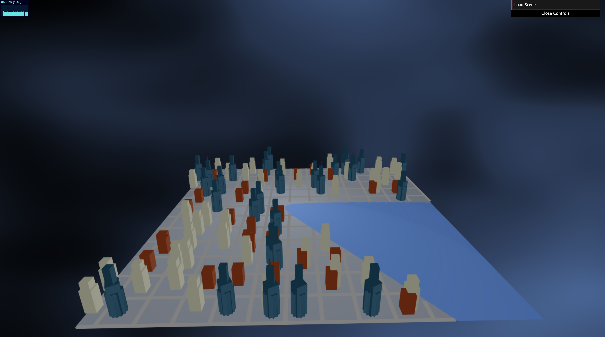

CIS 566 Homework 6: City Generation
=====================================

Written by Julia Chun (hyojchun)

Project Results
----------------
### Output

Demo can be found here:  https://hjchun96.github.io/hw06-city-generation/.

Below is the final image generated by the code:

Implementation Details
----------------------
### Overview
The main file owns an instance of a terrain, lsystem, and citygrid. The shared file `TerrainInfo` contains information about the voroni function used and the appropriate population density as well as height of the terrain. The lsystem dictates information about the road generation and the main part of this project, the citygrid, dictates rules on how the grids and buildings are generated. It takes in the list of edges generated by the lsystem and builds the rest of the city around it. The resulting city is one under a gloomy sky, with buildings that focus less on realism but look more like board game assets.

### Terrain Elevation
* The vertex's x, y positions and user specified seeds were passed through a Voronoi noise function to generate a elevation map. A threshold of 0.3 was used for the elevation map to separate the land from water, which are colored and elevated lower than the land.

### Grid Generation
* A grid of width 100 x 100 is generated. The grids are rasterized every 8 pixels and are validated by making sure that they do not overlap with a road or water.

### Art Directed Building Generation
* Randomly scattered points are placed if population  density at the particular point, indicated by the voronoi function, is greater than 0.1. I also added boundary checks to ensure that the building doesn't cover part of the grid and avoid overlapping with other buildings.

* Three different types of buildings are generated based on the population density at the location. However, instead of starting from a particular height, I implemented the system so that the building builds upwards from the base until it reaches a certain height. Depending on the which category the density value falls in (between high, medium, low), the buildings are generated in a different shape with varying heights and shading. The buildings at the highest point of density also got taller communication towers to distinguish them from other skyscrapers. Phong shading was done to make the buildings look more realistic. Note that the terrain was also lighted the same way in order to give the city a uniform feel.

### Procedural Sky
* The base color was blended with a darker grey randomly placed using fbm noise function and dampened in order to give a gloomier look.
